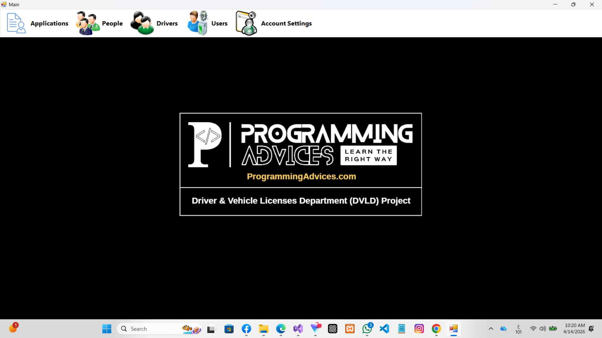
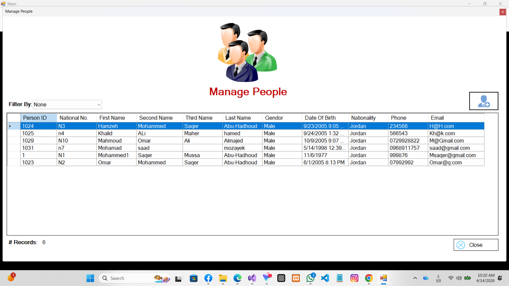
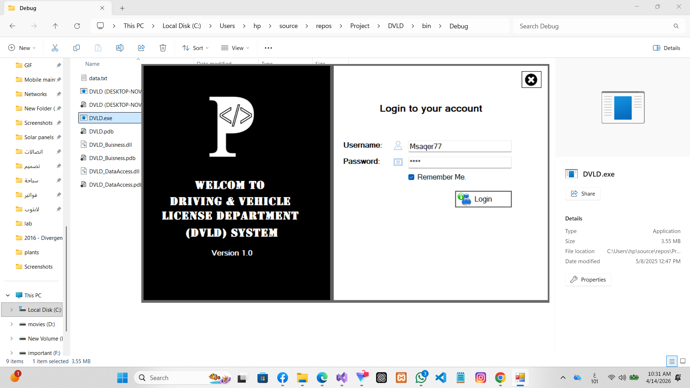

# Driving License Management System

## 📌 Overview
This is a desktop application built using C# for managing the process of issuing driving licenses.  
It helps organize applicants, tests, and license approvals in a structured way.

## 🚀 Features
- Manage applicants (add, update, delete)
- Handle driving tests
- Store user data
- Organize license issuance process
- Simple and user-friendly interface

## 🛠️ Technologies Used
- C#
- .NET Framework
- Windows Forms

## 📂 Project Structure
- Applications: Main application logic
- Drivers: Driver-related data
- People: Applicant information
- Tests: Driving tests
- User: System users

## ▶️ How to Run
1. Open the project in Visual Studio  
2. Build the solution  
3. Run the application  

## images

## 👨‍💻 Author
Saad Mozayek
